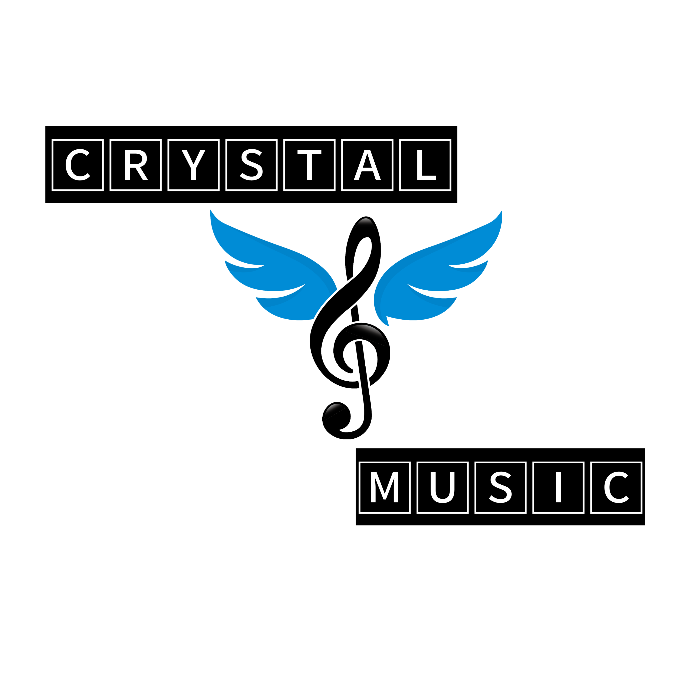

<h1 align="center">
  

<h2 align="centre">🎵 CRYSTAL HEART MUSIC!</h1>

### Aku Pemutar Musik Di-Telegram, Aku Akan Menemani Ke-Galauan Di VOICE CHAT GRUP!

<h3> FITUR BARU DARI BOT MUSIK! 🔥 </h2>

- Thumbnail Support
- Playlist Support
- Current playback support
- Showing track names when skipping
- Zero downtime, Fully Stable
- DEEZER,YOUTUBE & SAAVN PLAYBACK SUPPORTED
- Settings panel
- Control with buttons
- Userbot auto join

### COMMAND! 🛠
#### FITUR UNTUK MEMBER GRUP!

- `/play <song name>` - play song you requested
- `/dplay <song name>` - play song you requested via deezer
- `/splay <song name>` - play song you requested via jio saavn
- `/playlist` - Show now playing list
- `/current` - Show now playing
- `/song <song name>` - download songs you want quickly
- `/search <query>` - search videos on youtube with details
- `/deezer <song name>` - download songs you want quickly via deezer
- `/saavn <song name>` - download songs you want quickly via saavn
- `/video <song name>` - download videos you want quickly

#### FITUR UNTUK ADMIN GRUP!.
- `/player` - open music player settings panel
- `/pause` - pause song play
- `/resume` - resume song play
- `/skip` - play next song
- `/end` - stop music play
- `/userbotjoin` - invite assistant to your chat
- `/userbotleave` - remove assistant from your chat
- `/adminreload` - Refresh admin list

### Deploy To Heroku</h4>

### Generate String Session

Gabung Ke Grup & Channel Aku! [Grup Aku!](https://t.me/humangabutguys) Channel Grup! [Channel Aku!](https://t.me/captionanakmuda)

### Credits
- [Afterday](https://github.com/anehajahlu)
- [Risman](https://github.com/mrismanaziz)
- [InukaASiTH](https://github.com/InukaAsith): Dev
- [Wrench](https://github.com/EverythingSuckz/): Dev
- [QueenArzoo](https://github.com/QueenArzoo): Dev
- [lucifeermorningstar](https://github.com/lucifeermorningstar): Dev
- [Hamker Cat](https://github.com/thehamkercat/)
- [Anjana-Ma](https://github.com/Anjana-Ma): 
- [ImJanindu](https://github.com/ImJanindu): 
- [Laky](https://github.com/Laky-64) & [Andrew](https://github.com/AndrewLaneX): PyTgCalls
- [Original Repo owners](https://github.com/suprojects/CallsMusic)
